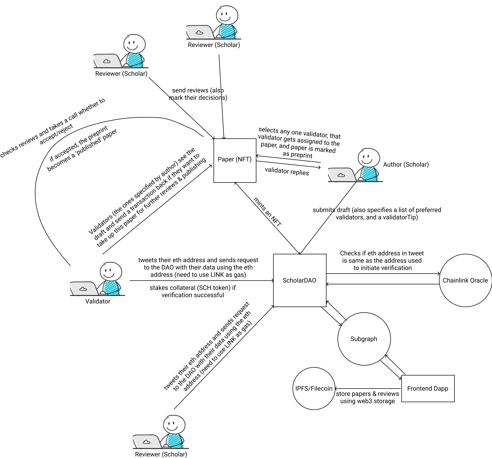

# ScholarDAO

Subgraph URL: https://thegraph.com/legacy-explorer/subgraph/scholardao/scholar-dao

Workflow:


## 🏄‍♂️ Quick Start

Prerequisites: [Node](https://nodejs.org/en/download/) plus [Yarn](https://classic.yarnpkg.com/en/docs/install/) and [Git](https://git-scm.com/downloads)

> clone/fork the repo:

```bash
git clone https://github.com/scholardao/monorepo
```

> install and start your 👷‍ Hardhat chain:

```bash
cd monorepo
yarn install
yarn chain
```

> in a second terminal window, start your 📱 frontend:

```bash
cd monorepo
yarn start
```

> in a third terminal window, 🛰 deploy your contract:

```bash
cd monorepo
yarn deploy
```

🔏 Edit your smart contract `YourContract.sol` in `packages/hardhat/contracts`

📝 Edit your frontend `App.jsx` in `packages/react-app/src`

💼 Edit your deployment scripts in `packages/hardhat/deploy`

📱 Open http://localhost:3000 to see the app

### NOTE

- Deploy [eth-address-verifier-cl-ea](https://github.com/rajdeepbh/eth-address-verifier-cl-ea) to a Chainlink node and call it from the smart contracts present here.
